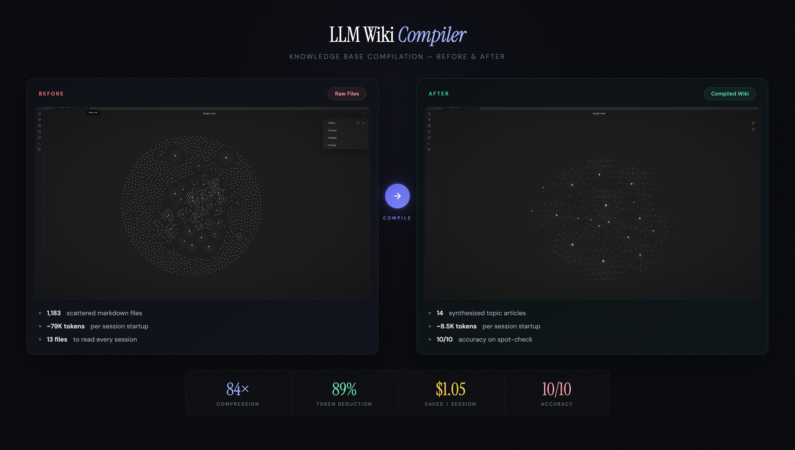
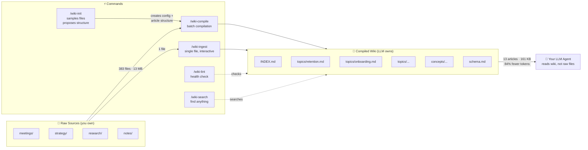

# LLM Wiki Compiler

A Claude Code plugin that compiles scattered markdown knowledge files into a topic-based wiki. Reduce context costs by ~90% and get instant answers from synthesized knowledge.

**[Documentation](https://saydo-5cd0e3d7.mintlify.app/)**

## Inspiration

This plugin implements the **LLM Knowledge Base** pattern described by [Andrej Karpathy](https://x.com/karpathy/status/2039805659525644595):

> *"Raw data from a given number of sources is collected, then compiled by an LLM into a .md wiki, then operated on by various CLIs by the LLM to do Q&A and to incrementally enhance the wiki, and all of it viewable in Obsidian. You rarely ever write or edit the wiki manually, it's the domain of the LLM."*

The key insight: instead of re-reading hundreds of raw files every session, have the LLM compile them into topic-based articles once, then query the synthesized wiki. Knowledge compounds instead of fragmenting.

## What It Does

You have 100+ markdown files across meetings, strategy docs, session notes, and research. Every Claude session re-reads them. This plugin compiles them into topic-based articles that synthesize everything known about each subject — with backlinks to sources.

**Before:** Read 13+ raw files (~3,200 lines) per session
**After:** Read INDEX + 2 topic articles (~330 lines) per session



### How It Works



## Install

### From GitHub

```bash
# 1. Clone the repo
git clone https://github.com/ussumant/llm-wiki-compiler.git

# 2. Add as a local marketplace
claude plugin marketplace add /path/to/llm-wiki-compiler

# 3. Install the plugin
claude plugin install llm-wiki-compiler

# 4. Restart Claude Code for hooks to register
```

### For a Single Session (no install)

```bash
claude --plugin-dir /path/to/llm-wiki-compiler/plugin
```

## Quick Start

```bash
# 1. Initialize — auto-detects directories, samples your files, proposes a
#    domain-specific article structure for your approval
/wiki-init

# 2. Compile — reads all sources, creates topic articles (5-10 min first run)
/wiki-compile

# 3. Browse in Obsidian — open wiki/INDEX.md to see all topics with backlinks

# 4. (Optional) Add the wiki to your AGENTS.md so Claude uses it automatically
#    See "Integrating with AGENTS.md" section below
```

After step 4, Claude naturally reads wiki articles as part of its normal session flow — no special commands needed.

## How It Works

### Commands

| Command | Purpose |
|---------|---------|
| `/wiki-init` | One-time setup -- auto-detects markdown directories, samples files, proposes custom article structure |
| `/wiki-compile` | Compiles source files into topic articles (incremental -- only recompiles changes). Generates `schema.md` on first run. |
| `/wiki-ingest` | Add a single source interactively -- read, discuss key takeaways, update relevant wiki articles |
| `/wiki-search` | Search across wiki articles by keyword or phrase |
| `/wiki-lint` | Health checks -- finds stale articles, orphan pages, missing cross-references, contradictions, low coverage |
| `/wiki-query` | Optional -- Q&A against the wiki. Can file useful answers back into wiki articles. |
| `/wiki-upgrade` | Update the plugin to the latest version from GitHub |

The primary workflow is: **init → compile → add to AGENTS.md → done.** After that, Claude reads the wiki automatically. `/wiki-query` is a convenience for testing or quick lookups.

### Staged Adoption (The Key Feature)

The plugin never modifies your existing CLAUDE.md or AGENTS.md. Instead, it injects context via a SessionStart hook with three modes:

| Mode | What Happens | Your Existing Setup |
|------|-------------|-------------------|
| **staging** (default) | "Wiki available — check it when you need depth" | Completely unchanged |
| **recommended** | "Check wiki articles before raw files" | Unchanged, but Claude prioritizes wiki |
| **primary** | "Wiki is your primary knowledge source" | You can optionally simplify startup reads |

Change mode by editing `.wiki-compiler.json`:
```json
{ "mode": "staging" }  →  { "mode": "recommended" }  →  { "mode": "primary" }
```

### What Gets Compiled

During `/wiki-init`, the compiler samples your source files and proposes an article structure that fits your domain. You approve (or tweak) the sections before anything gets compiled.

For example, a product team's wiki might get:
- **Summary** — **Timeline** — **Current State** — **Key Decisions** — **Experiments & Results** — **Gotchas** — **Open Questions** — **Sources**

While a research wiki might get:
- **Summary** — **Key Findings** — **Methodology** — **Evidence** — **Gaps & Contradictions** — **Open Questions** — **Sources**

And a book notes wiki might get:
- **Summary** — **Characters** — **Themes** — **Plot Threads** — **Connections** — **Quotes** — **Sources**

The structure is saved in `.wiki-compiler.json` and can be edited anytime. **Summary** and **Sources** are always included.

### Coverage Indicators (Best of Both Worlds)

Every section includes a coverage tag so you (or your AI agent) know when to trust the wiki vs when to read raw sources:

```markdown
## Summary [coverage: high -- 15 sources]
...trust this, it's well-sourced...

## Experiments & Results [coverage: medium -- 3 sources]
...decent overview, check raw files for details...

## Gotchas [coverage: low -- 1 source]
...read the raw gotchas.md directly...
```

- **high** (5+ sources) — trust the wiki section directly
- **medium** (2-4 sources) — good overview, check raw sources for granular questions
- **low** (0-1 sources) — read the raw sources listed in that section

This gives you the speed of the wiki (84% fewer tokens) without sacrificing accuracy. Your agent reads the wiki first, and only falls back to raw files for low-coverage sections.

### Obsidian Compatible

The wiki output is plain markdown with Obsidian-style `[[wikilinks]]`. Open `wiki/INDEX.md` in Obsidian and you'll see the full knowledge base with bidirectional links to source files.

### Concept Articles (Cross-Cutting Patterns)

After compiling topic articles, the compiler looks for patterns that span 3+ topics and generates **concept articles** in `wiki/concepts/`. These are interpretive, not just factual -- they answer "what does this pattern mean?" not just "what happened?"

Examples from a real project:
- **"Speed vs Quality Tradeoff"** -- 6 instances where this decision appeared across retention, push notifications, and experiment design
- **"Cross-Team Decision Patterns"** -- communication patterns and decision dynamics synthesized from 24 meetings
- **"Evolution of Retention Thinking"** -- how the approach changed from Oct 2025 to Apr 2026 across analytics, strategy, and experiments

Concept articles are discovered automatically during compilation. You can also seed them in `schema.md` if you know what patterns you want tracked.

### Schema Document

On first compile, a `schema.md` is generated in your wiki output directory. It defines your wiki's structure: topic list, naming conventions, article format, and cross-reference rules.

You can edit `schema.md` to rename topics, merge them, or add conventions. The compiler reads it before each run and respects your changes. New topics get added automatically with an evolution log entry.

### Wiki Lint

Run `/wiki-lint` to check wiki health:

- **Stale articles** -- sources changed since last compile
- **Orphan pages** -- articles with deleted/missing sources
- **Missing cross-references** -- topics sharing 3+ sources that don't link to each other
- **Low coverage sections** -- `[coverage: low]` tags flagged for improvement
- **Contradictions** -- conflicting facts across articles (e.g., different dates for same event)
- **Schema drift** -- topics in wiki/ not listed in schema.md, or vice versa

### Query Filing

When `/wiki-query` produces a useful synthesis that connects information across topics, it offers to file the answer back into the relevant wiki article. Your explorations compound in the knowledge base instead of disappearing with the session.

## Configuration

`.wiki-compiler.json` (created by `/wiki-init`):

```json
{
  "version": 1,
  "name": "My Project",
  "sources": [
    { "path": "Knowledge/", "exclude": ["wiki/"] },
    { "path": "docs/meetings/" }
  ],
  "output": "Knowledge/wiki/",
  "mode": "staging",
  "topic_hints": ["retention", "onboarding"],
  "link_style": "obsidian"
}
```

| Field | Description |
|-------|-------------|
| `name` | Display name for the knowledge base |
| `sources` | Directories to scan for .md files |
| `output` | Where compiled wiki lives |
| `mode` | `staging` / `recommended` / `primary` |
| `article_sections` | Article structure — generated during `/wiki-init` based on your content (see below) |
| `topic_hints` | Optional seed topics to guide classification |
| `link_style` | `obsidian` (wikilinks) or `markdown` (standard links) |

### Custom Article Structure

The `article_sections` array defines what sections appear in each topic article. It's generated during `/wiki-init` by sampling your source files — the compiler proposes sections that fit your domain, and you approve or tweak them.

```json
"article_sections": [
  { "name": "Summary", "description": "standalone briefing of the topic", "required": true },
  { "name": "Key Findings", "description": "main discoveries and insights" },
  { "name": "Methodology", "description": "approaches and methods used" },
  { "name": "Open Questions", "description": "unresolved threads and gaps" },
  { "name": "Sources", "description": "backlinks to all contributing files", "required": true }
]
```

You can edit this array anytime — add, remove, or rename sections. The compiler will use your updated structure on the next `/wiki-compile` run. `Summary` and `Sources` are required and cannot be removed.

If `article_sections` is missing (older configs), the compiler falls back to a default template.

## Safety Guarantees

- Source files are **never modified** — the compiler only writes to the output directory
- The wiki can be **deleted and regenerated** at any time from source files
- Your **CLAUDE.md and AGENTS.md are never touched** — context injection happens via hooks
- **Rollback anytime** — change mode back to `staging` or delete `.wiki-compiler.json`

## Cost Savings (Real Data)

Tested on a real project with 1,183 markdown files across meetings, strategy docs, session histories, and research notes.

### Token Reduction

| | Without Wiki | With Wiki |
|---|---|---|
| Session startup context | ~79K tokens (13 files) | ~8.5K tokens (INDEX + 2-3 articles) |
| Per-question research | ~8,000 tokens (10+ files) | ~600 tokens (1 article) |
| **Reduction** | — | **89%** |

### Compilation Costs

| | Tokens | Cost (Opus) | Cost (Sonnet) |
|---|---|---|---|
| First compilation | ~880K | ~$13 | ~$2.60 |
| Daily incremental | ~100K | ~$1.50 | ~$0.30 |
| **Break-even** | — | **First session** | **First session** |

### Accuracy

We spot-checked wiki articles against their raw source files:

- **10/10 key facts accurately synthesized** -- no fabrication, no missing critical details
- **Coverage indicators are honest** -- sections marked `[coverage: high]` had 5+ contributing sources
- **Trade-off is transparent** -- wiki captures ~90% of raw file content; coverage tags tell you when to fall back to raw sources for the remaining 10%

### Compression

- 1,183 files → 14 topic articles -- **84x compression**
- Session startup: 13 file reads → 1 INDEX + 2-3 topic articles -- **89% fewer tokens**
- ~$1.05 saved per session at Opus pricing ($15/M input tokens)

## Integrating with AGENTS.md (Recommended)

This is the main way to use the wiki long-term. After you've compiled and spot-checked the output, add this to your project's AGENTS.md or CLAUDE.md:

```markdown
## Knowledge Base

A compiled knowledge wiki is available at `{your output path}/`.

**Session startup:** Read `wiki/INDEX.md` for a topic overview, then read
specific topic articles relevant to your current task.

**Using coverage indicators:** Each section has a coverage tag:
- `[coverage: high]` -- trust this section, skip the raw files.
- `[coverage: medium]` -- good overview, check raw sources for granular questions.
- `[coverage: low]` -- read the raw sources listed in that section directly.

**When you need depth:** Check the article's Sources section for links to
raw files. Only read raw sources for medium/low coverage sections or when
you need very specific detail.

**Never modify wiki files directly** -- they are regenerated by `/wiki-compile`.
```

Once this is in your AGENTS.md, Claude automatically uses the wiki every session with smart fallback. High-coverage sections save tokens. Low-coverage sections point Claude to the exact raw files it needs.

**When to add this:** After running `/wiki-compile` at least once and validating that the topic articles accurately reflect your knowledge.

## Advanced

### Incremental Compilation

After the first full compile, `/wiki-compile` only recompiles topics whose source files changed. INDEX.md is always regenerated.

### Force Full Recompile

```
/wiki-compile --full
```

### Compile Single Topic

```
/wiki-compile --topic retention
```

### Interactive Ingest

Add sources one at a time with `/wiki-ingest`:

```
/wiki-ingest path/to/new-meeting-notes.md
```

The compiler reads the file, shows you key takeaways, asks what to emphasize, then updates all relevant topic articles. A single source might touch multiple topics — the compiler handles the cross-referencing.

This is Karpathy's recommended workflow for staying involved with your knowledge base as it grows. Use `/wiki-compile` for batch processing, `/wiki-ingest` for interactive single-source additions.

### Wiki Search

Search your compiled wiki:

```
/wiki-search retention experiments
```

Searches topic names first (fast), then full article content if needed. Results include coverage indicators so you know when to trust the wiki vs read raw sources.

For synthesis questions that require connecting multiple topics, use `/wiki-query` instead.

For large wikis (100+ topics), consider adding [qmd](https://github.com/jina-ai/qmd) as an MCP server for hybrid BM25/vector search with LLM re-ranking.

### Scheduled Compilation

Use Claude Code's `/schedule` to set up daily automatic compilation.

### Updating the Plugin

From inside Claude Code:
```
/wiki-upgrade
```

This pulls the latest version from GitHub and shows what changed. Restart Claude Code after to load new commands and hooks.

If `/wiki-upgrade` isn't available yet (older version), update manually:
```bash
cd /path/to/llm-wiki-compiler && git pull
claude plugin update llm-wiki-compiler
# Then restart Claude Code
```

## License

MIT
